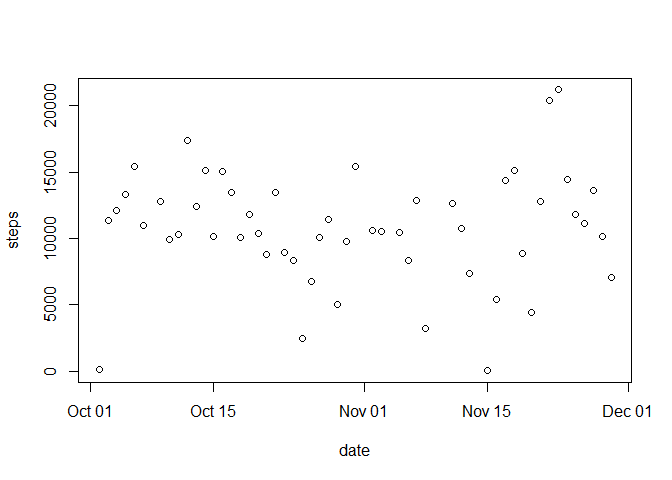
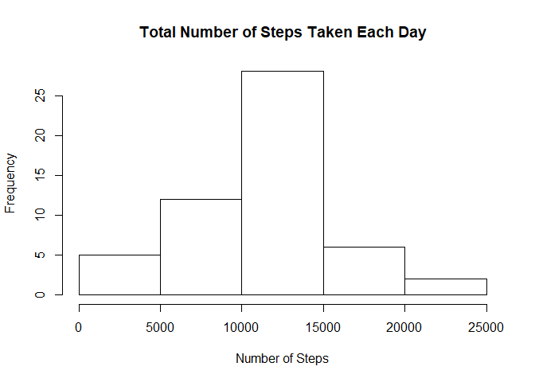
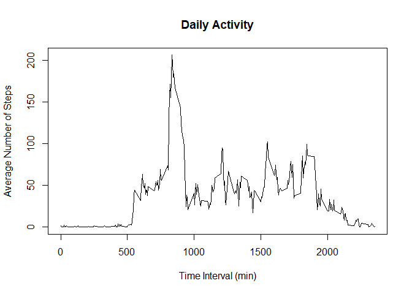
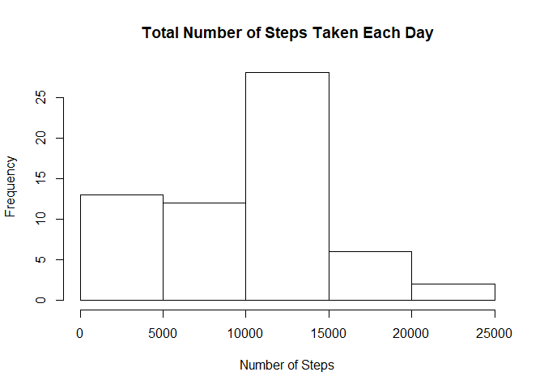
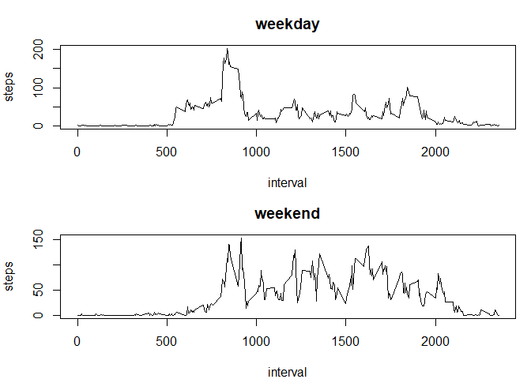

We will first unqip and load the data.
## Loading and preprocessing the data

```r
unzip("activity.zip")
activity <- read.csv("activity.csv")
```

## What is mean total number of steps taken per day?
First, to look at the total number of steps taken per day, we would have to remove the missing data. We can achieve both of these through the use of the aggregate() function.

```r
dailystepstotal <- aggregate(steps ~ date, activity, sum)
```


## What is the average daily activity pattern?
We also note that the class of the date columns in dailystepsmean is a factor. Thus, we would need to transform it to a date format for plotting. We can then produce a simple plot from the data.

```r
class(dailystepstotal$date)
```

```
## [1] "factor"
```

```r
dailystepstotal$date <- as.Date(dailystepstotal$date, "%Y-%m-%d")
class(dailystepstotal$date)
```

```
## [1] "Date"
```

```r
plot(dailystepstotal)
```

<!-- -->

We would then like to see a histogram of the total number of steps each day. To do that, we can plot using the hist() function.

```r
hist(dailystepstotal$steps, 
     main = "Total Number of Steps Taken Each Day", 
     xlab = "Number of Steps")
```

<!-- -->

To look into the mean and median of total number of steps each day, we make use of the tapply() function.

```r
mean(dailystepstotal$steps)
```

```
## [1] 10766.19
```

```r
median(dailystepstotal$steps)
```

```
## [1] 10765
```

Now, we would like to look into the average daily activity pattern. To do that, we will make a time series plot.

```r
dailystepsmean <- aggregate(steps ~ interval, activity, mean)
plot(dailystepsmean$interval,dailystepsmean$steps, 
     type = "l",
     main = "Daily Activity",
     xlab = "Time Interval (min)",
     ylab = "Average Number of Steps")
```

<!-- -->

To find the 5 minute interval where the greatest average number of steps is recorded, we can subset the row where the maximum number of steps can be found.

```r
dailystepsmean[dailystepsmean$steps == max(dailystepsmean$steps),]
```

```
##     interval    steps
## 104      835 206.1698
```


## Imputing missing values
To look into the number of missing values in the dataset, we can use the sum() and is.na() functions to count the number of NAs.

```r
sum(is.na(activity))
```

```
## [1] 2304
```

With all the missing values present in this dataset, one might wonder what the actual dataset would be like with all the values filled in. We can emulate that by imputing all the NA values with the weighted moving average with k=5 in the given day. This can be done using the imputeTS package.

```r
library(imputeTS)
```

```
## Warning: package 'imputeTS' was built under R version 3.6.3
```

```
## Registered S3 method overwritten by 'quantmod':
##   method            from
##   as.zoo.data.frame zoo
```

```r
newactivity <- na_ma(activity, k = 5)
```

We can then make a histogram of the total number of steps taken each day using the new dataset.

```r
newdailystepstotal <- aggregate(steps ~ date, newactivity, sum)
hist(newdailystepstotal$steps,
     main = "Total Number of Steps Taken Each Day",
     xlab = "Number of Steps",
     )
```

<!-- -->

We can also look at the mean and median of the new dataset.

```r
mean(newdailystepstotal$steps)
```

```
## [1] 9354.23
```

```r
median(newdailystepstotal$steps)
```

```
## [1] 10395
```

We can see that the value of the mean is reduced by quite a bit from the original dataset, but the median is roughly about the same, albeit slightly lower. This can also be seen in the histogram, where the frequency of steps below 5000 per day also increased. As we imputed the dataset, the missing data took on the moving average of the k=5 nearest neighbours, most of which were often close to 0. Thus, it would make sense that the imputed dataset has a lowered mean. Also, since the total number of steps taken each day follows a normal distribution with its peak around the 10000 to 15000 steps in both datasets, it would also make sense that the median remained relatively unchanges.

## Are there differences in activity patterns between weekdays and weekends?
Next, we would like to split the dataset into weekdays and weekends. To do this, we make use of the weekdays() to separate out the rows based on the day of the week, and the ifelse() function to label them. We can then bind these using the cbind() function.

```r
newactivity$date <- as.Date(newactivity$date, "%Y-%m-%d")
day.of.week <- weekdays(newactivity$date)
day.of.week <- ifelse(day.of.week %in% c("Saturday", "Sunday"), "weekend", "weekday")
newactivity <- cbind(newactivity,day.of.week)
```

We can then look into the mean number of steps on weekdays and weekends by subsetting the dataset.

```r
weekday <- subset(newactivity, day.of.week == "weekday")
weekend <- subset(newactivity, day.of.week == "weekend")
newdailystepsweekday <- aggregate(steps ~ interval, weekday, mean)
newdailystepsweekend <- aggregate(steps ~ interval, weekend, mean)
```

We can then make a panel plot with a time series plot of the average number of steps taken in both weekdays and weekend.

```r
par(mfcol = c(2,1))
par(mar = c(4, 4, 3, 1))
plot(newdailystepsweekday,
     type = "l",
     main = "weekday")
plot(newdailystepsweekend,
     type = "l",
     main = "weekend")
```

<!-- -->
